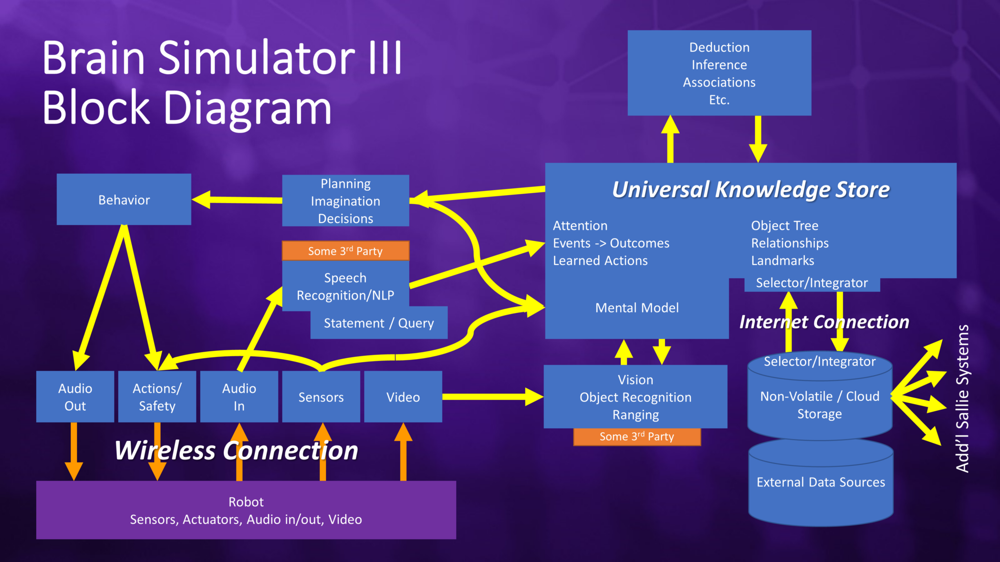

GitHub: https://github.com/FutureAIGuru/BrainSimIII

Website: https://futureaisociety.org/

Youtube Channel: https://www.youtube.com/@FutureAISociety

# Approach
Incremental development: Creating the simplest ideas first.

# Architecture

# Code

## CodeConfigurationFiles

## CodeLibararies

## CodeProgrammingLanguage
- C#
- Python

## CodeRepositoryStructure
**At the moment**
Link: https://github.com/FutureAIGuru/BrainSimIII

**Idea**

# Community

## CommunityDiscord
Link: https://discord.com/invite/Vk7snD6TvG

## CommunityExchange
- Discord (https://discord.com/invite/Vk7snD6TvG)
- Webevents (https://futureaisociety.org/participate/upcoming-events/)

# Concept

## ConceptCommonSense

## ConceptComprehension

## ConceptHearing

## ConceptNeuron

## ConceptNeuronCircuit

## ConceptSpeaking

## ConceptSynapse

## ConceptVision

# Contributing
- Discussion
- Donation
- Cooperation
- Open source

(https://futureaisociety.org/participate/volunteer/)

# Cooperation

# Documentation

The central place to learn more about the project. The Goal would be to have every relevant thing findable here. Either by text, picture or a link for more information.

## DocumentationAccess
- Git
- Github
- Website

## DocumentationBuild
**GitHub Actions**

Can be used to automate the build-process of the HTML-documentation-files whenever a commit to the main branch is made. So the Docs can always stay up to date.

GitHub Action Documentation Build Config: [link]

**MkDocs**

A config file "/Docs/mkdocs.yml" needs to be created. Parameters for the build-process and output can be written in it. Mkdocs, when run, will basically then read the content-files from "/Docs/Content/" ('docs_dir') and give out the HTML-files into "/Docs/Site/" ('site_dir').

## DocumentationDeployment
**GitHub Pages**

Setup atm: GitHub Pages reads the website-files from the folder "/Docs/Site/" and puts the site available/usable via a webserver. 

(/By default GitHub Pages uses a branch from the project-repository with just the website-files on it. But that is less easy to navigate and inspect the website-files, and can conflict with the understanding of what branches are usually for.)

**GitHub Pages Configuration**

(TBD)

## DocumentationFormat
Markdown (.md) to HTML.

## DocumentationGitHubRepositoryStructure
**./Docs/**

**./Docs/Content**

// Direcory for selfwritten documentation md-files.

**./Docs/ContentAPI**

// Direcory for automaticly generated API documentation files.

**./Docs/Content/Image**

// Direcory for images used for the documentation md-files. Seperated for easier handling of each files of a filetype.

**./Docs/Site**

// Output-Direcory of build up documentation from a static site generator (SSG) ('MkDocs' atm).

**./Docs/Stylsheet**

// Direcory for styling-parameters to build the documentation beyond the default possable styles of the documentation-tool ('MkDocs'). (//A placeholder-folder atm)

## DocumentationSidebarStrucure
> - Area
> - AreaThing

One level. (Lets the content be in the foreground) (Helps with quick navigation)

## DocumentationSorage
- Github

## DocumentationTitles
> ThingDetailDetailDe..

This gives every title a context on its own.

# Media
- Book (https://futureaisociety.org/resources/books/)
    - Will Computers Revolt? : Preparing for the Future of Artificial Intelligence
    - Brain Simulator II : Manual for Creating Artificial General Intelligence
- Youtube Channel (https://www.youtube.com/@FutureAISociety)

# People
- Charles J. Simon ([GitHub](https://github.com/FutureAIGuru), [Books](https://futureaisociety.org/resources/books/))

# Software

## SoftwareCompilation
Via Visual Studio (not VSCode).

Video: Getting Started with Brain Simulator III - 
Future AI Society (https://www.youtube.com/watch?v=eSNRHZ6mypk)

## SoftwareDownload
- Downloading the repository from GitHub
- GitHub Packages (TBD)
- GitHub Releases (TBD)

## SoftwareInstallation
For the time being: [SoftwareCompilation](#softwarecompilation).

## SoftwareModule
//API documentaion. Respectively here or "SoftwareModule" in/on its own website-tab?

## SoftwareModuleHearing

## SoftwareModuleSpeaking

## SoftwareModuleVision

# Tools
- MkDocs (https://www.mkdocs.org/) 
    - Plugins:
        - awsome-pages
        - search
    - Theme (Websitedesign):
        - Material for MkDocs (https://squidfunk.github.io/mkdocs-material/).
- GitHub (https://github.com/)

# Website

## WebsiteAspiration
- Accespoint