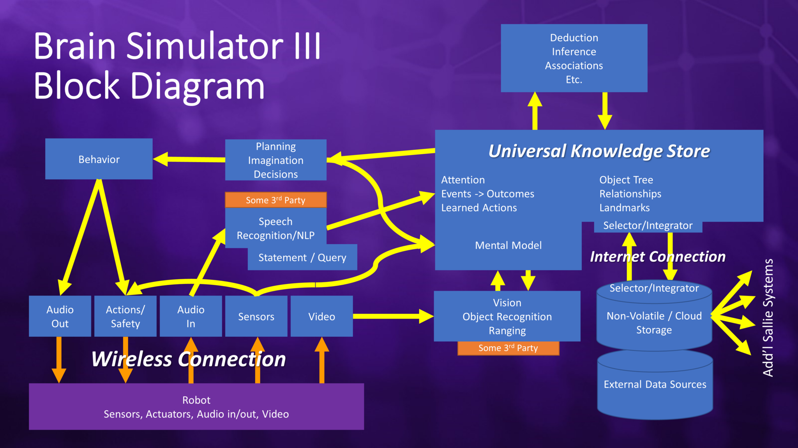
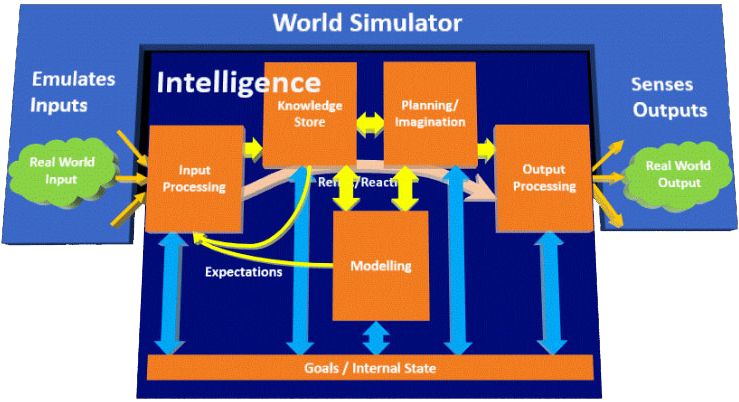

GitHub: https://github.com/FutureAIGuru/BrainSimIII

Website: https://futureaisociety.org/

Youtube Channel: https://www.youtube.com/@FutureAISociety

# Approach
Incremental development: Creating the simplest ideas first.

# Architecture

# Code

## CodeConfigurationFiles

## CodeLibararies

## CodeProgrammingLanguage
- C#
- Python

## CodeRepositoryStructure
(https://github.com/FutureAIGuru/BrainSimIII)

# Community

## CommunityDiscord
Link: https://discord.com/invite/Vk7snD6TvG

## CommunityExchange
- Discord (https://discord.com/invite/Vk7snD6TvG)
- Webevents (https://futureaisociety.org/participate/upcoming-events/)

# Concept

## ConceptCommonSense

## ConceptComprehension

## ConceptHearing

## ConceptNeuron

## ConceptNeuronCircuit

## ConceptSpeaking

## ConceptSynapse

## ConceptVision

# Contributing
- Discussion
- Donation
- Cooperation
- Open source

(https://futureaisociety.org/participate/volunteer/)

# Cooperation

# Documentation

## DocumentationAccess
- Git
- Github
- Website

## DocumentationFormat
Markdown (.md) to HTML.

## DocumentationGitHubRepositoryStructure
**./Docs/**

**./Docs/Build**

// Output-Direcory of build up documentation from a static site generator (SSG).

**./Docs/Content/**

// Direcory for selfwritten documentation parts.

**./Docs/ContentGenereated/**

// Direcory for automaticly generated documentation files.

## DocumentationSidebarStrucure
> - Area
> - AreaThing

One level. (Lets the content be in the foreground) (Helps with quick navigation)

## DocumentationSorage
- Github

## DocumentationTitles
> ThingDetailDetailDe..

This gives every title a context on its own.

# Media
- Book (https://futureaisociety.org/resources/books/)
    - Will Computers Revolt? : Preparing for the Future of Artificial Intelligence
    - Brain Simulator II : Manual for Creating Artificial General Intelligence
- Youtube Channel (https://www.youtube.com/@FutureAISociety)

# People
- Charles J. Simon ([GitHub](https://github.com/FutureAIGuru), [Books](https://futureaisociety.org/resources/books/))

# Software

## SoftwareCompilation
Via Visual Studio (not VSCode).

Video: Getting Started with Brain Simulator III - 
Future AI Society (https://www.youtube.com/watch?v=eSNRHZ6mypk)

## SoftwareDownload
- Downloading the repository from GitHub
- GitHub Packages (TBD)
- GitHub Releases (TBD)

## SoftwareInstallation
For the time being: [SoftwareCompilation](#softwarecompilation).

## SoftwareModule
//API documentaion. Respectively here or "SoftwareModule" in/on its own website-tab?

## SoftwareModuleHearing

## SoftwareModuleSpeaking

## SoftwareModuleVision

# Tools
- MkDocs (https://www.mkdocs.org/) (https://squidfunk.github.io/mkdocs-material/)
- GitHub (https://github.com/)

# Website

## WebsiteAspiration
- Accespoint